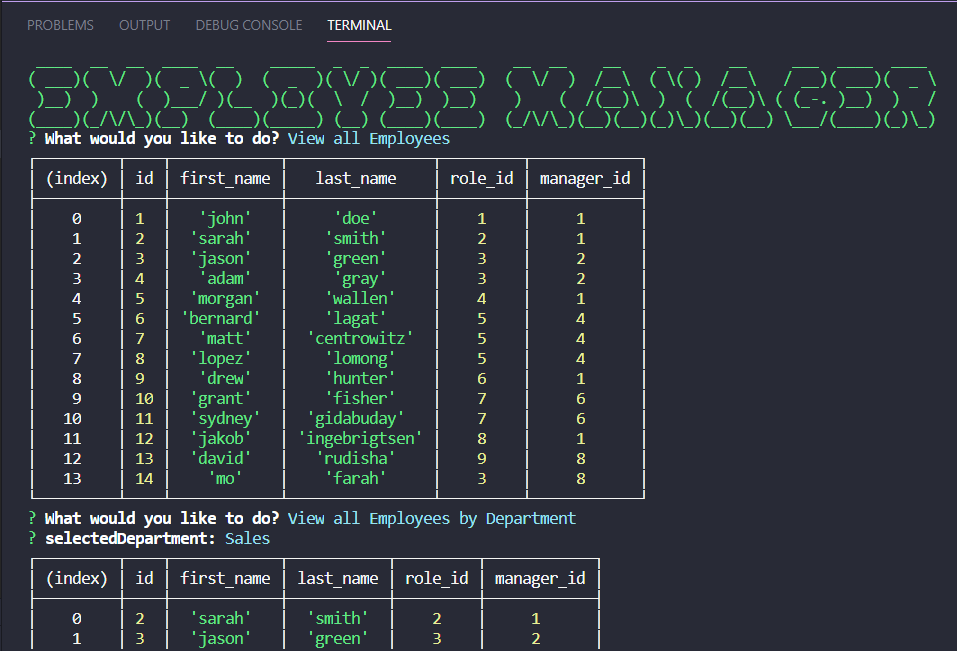

# Employee_Tracker

## Description
An interface that serves as a Content Management System for managing a company's employees using node, inquirer, and MySQL.

This built in command-line application allows the user to add departments, roles, and employees, view departments, roles, and employees, and update employee roles. Click the link below for a video walkthrough.

**[Check out the video here!](https://drive.google.com/file/d/1-Z7d5IIzcBIHGZ7wPe0pSHVjXTYoZc7j/view)**

To control the order the code executes, async & await functions are utilized. The user navigates a list inquirer prompt, sending a response into a switch statemtent that calls one of several asynchronous functions below, each of which has at least one SQL query that returns, deletes, or updates data from the database.

## Table of Contents
* [Usage](#usage)
* [Credits](#credits)
* [License](#license)

## Usage
* **The Finished Product**  

## Credits
Here are a few resources that helped me get this project knocked out!
* [FIGfont](http://www.jave.de/figlet/figfont.html)
* [Izweb Technologies](https://www.youtube.com/watch?v=7gKd0MYsSnE)
* [Figlet example](http://www.figlet.org/examples.html)
* [MDN Array.prototype.filter()](https://www.youtube.com/watch?v=7gKd0MYsSnE)
* [MySQL 8.0 Reference Guide](https://dev.mysql.com/doc/refman/8.0/en/sorting-rows.html)
* [w3schools includes() method](https://www.w3schools.com/jsref/jsref_includes.asp)

## License
* Link for more information: (https://opensource.org/licenses/MIT)
* MIT License

      Copyright (c) [year] [fullname]
      
      Permission is hereby granted, free of charge, to any person obtaining a copy
      of this software and associated documentation files (the "Software"), to deal
      in the Software without restriction, including without limitation the rights
      to use, copy, modify, merge, publish, distribute, sublicense, and/or sell
      copies of the Software, and to permit persons to whom the Software is
      furnished to do so, subject to the following conditions:
      
      The above copyright notice and this permission notice shall be included in all
      copies or substantial portions of the Software.
      
      THE SOFTWARE IS PROVIDED "AS IS", WITHOUT WARRANTY OF ANY KIND, EXPRESS OR
      IMPLIED, INCLUDING BUT NOT LIMITED TO THE WARRANTIES OF MERCHANTABILITY,
      FITNESS FOR A PARTICULAR PURPOSE AND NONINFRINGEMENT. IN NO EVENT SHALL THE
      AUTHORS OR COPYRIGHT HOLDERS BE LIABLE FOR ANY CLAIM, DAMAGES OR OTHER
      LIABILITY, WHETHER IN AN ACTION OF CONTRACT, TORT OR OTHERWISE, ARISING FROM,
      OUT OF OR IN CONNECTION WITH THE SOFTWARE OR THE USE OR OTHER DEALINGS IN THE
      SOFTWARE.
